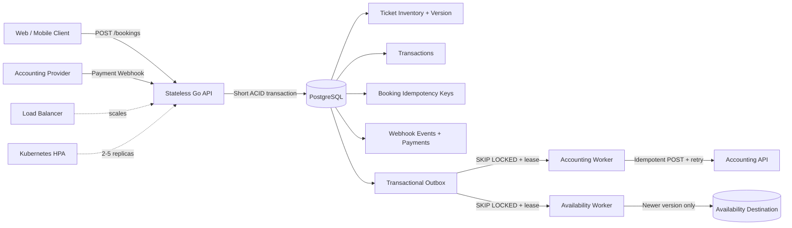
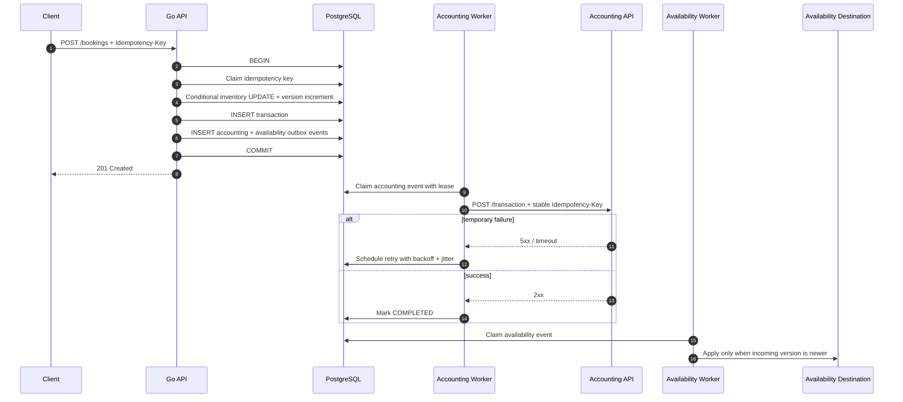
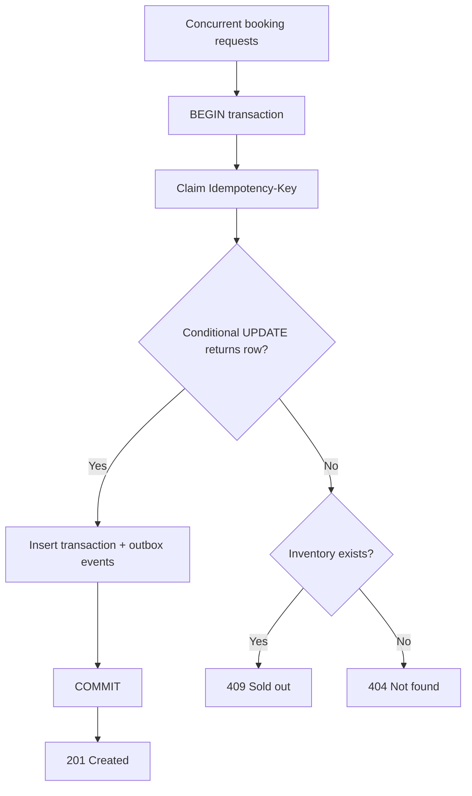
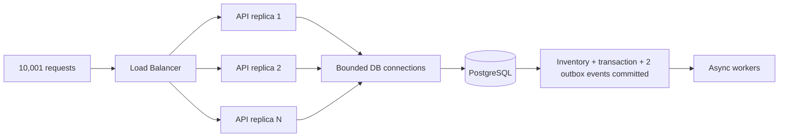
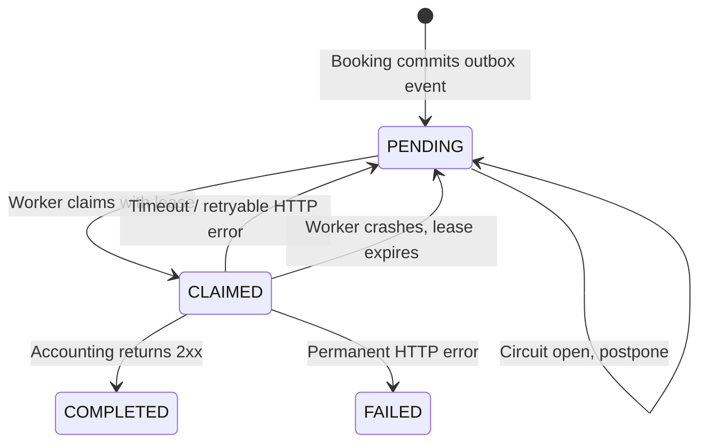
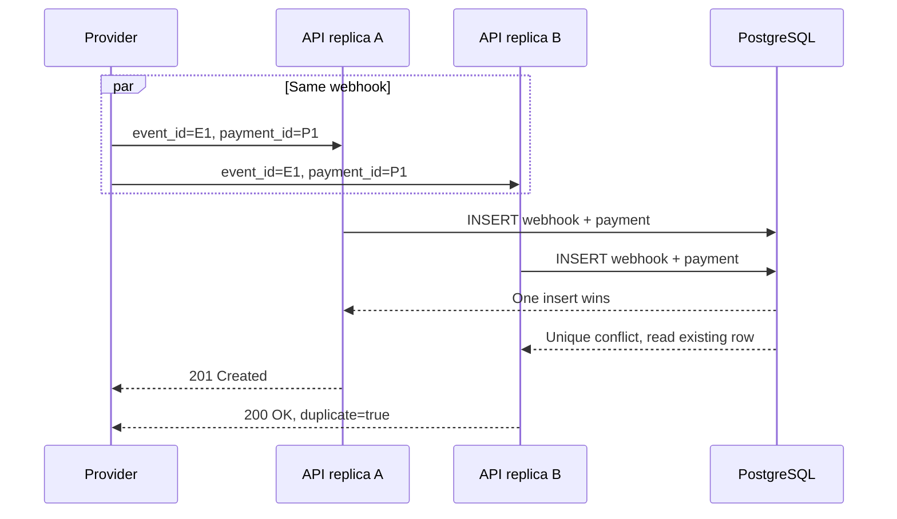
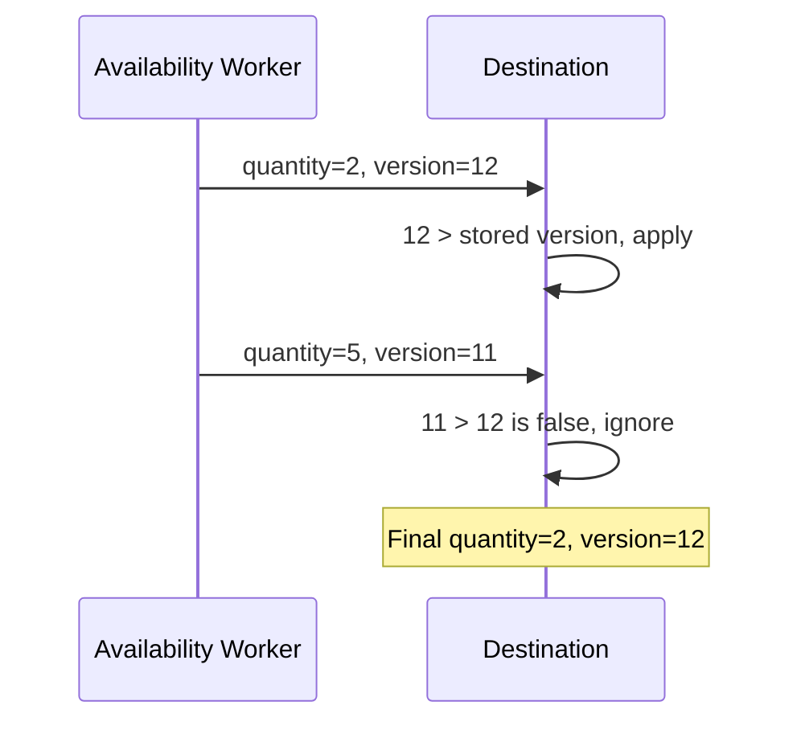

# Turnstile: Reliable Concert Ticket Booking Backend

**Nama:** `[Nama]`  
**Kontak:** `[Email / LinkedIn / GitHub]`  
**Source code:** [github.com/litegral/turnstile](https://github.com/litegral/turnstile)

## Table of Contents

1. [Ringkasan](#ringkasan)
2. [Arsitektur Sistem](#arsitektur-sistem)
3. [Skenario 1: Race Condition](#skenario-1-race-condition)
4. [Skenario 2: High Traffic Processing](#skenario-2-high-traffic-processing)
5. [Skenario 3: External API Integration](#skenario-3-external-api-integration)
6. [Skenario 4: Duplicate Request](#skenario-4-duplicate-request)
7. [Skenario 5: Data Synchronization](#skenario-5-data-synchronization)
8. [Cara Menjalankan dan Memverifikasi](#cara-menjalankan-dan-memverifikasi)
9. [Struktur Kode](#struktur-kode)
10. [Kesimpulan](#kesimpulan)

## Ringkasan

Turnstile adalah modular monolith berbasis Go dan PostgreSQL. Desain menjaga jalur booking tetap pendek, menaruh jaminan konsistensi utama di database, serta memindahkan integrasi eksternal ke background worker.

Lima mekanisme utama:

| Skenario | Mekanisme | Jaminan |
|---|---|---|
| Race condition | Atomic conditional `UPDATE` dalam transaksi PostgreSQL | Stok tidak negatif dan tidak oversold |
| High traffic | Stateless API, bounded connection pool, transaksi singkat, horizontal scaling | Success response sesuai transaksi yang committed |
| External API | Transactional outbox, retry, lease, circuit breaker, idempotency key | At-least-once delivery tanpa kehilangan event |
| Duplicate webhook | Unique constraints dan idempotent processing | Satu event dan satu payment |
| Out-of-order sync | Monotonic version dan conditional upsert | Data lama tidak menimpa data baru |

### Asumsi Umum

- PostgreSQL adalah source of truth dan tersedia melalui deployment yang sesuai kebutuhan produksi.
- Client mengirim `Idempotency-Key` stabil saat mengulang booking yang sama.
- Provider accounting mendukung idempotency key untuk deduplikasi request keluar.
- Webhook provider membawa `event_id`, `payment_id`, dan `transaction_id` yang stabil.
- Success berarti transaksi sudah committed di PostgreSQL, bukan accounting sudah menerima event secara sinkron.
- Target 10.000+ transaksi divalidasi terhadap workload dan environment pengujian yang dijelaskan di laporan ini; hasil produksi tetap memerlukan capacity test di infrastruktur target.

## Arsitektur Sistem



### Alur Booking Terpadu



## Skenario 1: Race Condition

### Masalah

Pola read-check-write memungkinkan beberapa request membaca stok `1` sebelum salah satunya mengurangi stok. Jika keputusan dibuat di memory aplikasi, lebih dari satu request dapat dianggap berhasil.

### Solusi

Reservasi dilakukan sebagai satu atomic conditional update dalam transaksi database:

```sql
UPDATE turnstile.ticket_inventory
SET available_quantity = available_quantity - $2,
    version = version + 1
WHERE id = $1
  AND available_quantity >= $2
RETURNING available_quantity, version;
```

PostgreSQL mengunci row yang diperbarui. Request pertama mengubah stok dari `1` menjadi `0`; request berikutnya mengevaluasi kondisi pada nilai terbaru, tidak mendapat row, lalu menerima `409 Conflict` (`sold out`). Dalam transaksi yang sama, aplikasi menyimpan transaksi, dua outbox event, dan hasil idempotency request. Kegagalan salah satu operasi membatalkan semuanya.



### Trade-off

Semua pembelian untuk inventory yang sama bersaing pada satu hot row. Ini menukar throughput per inventory dengan correctness yang kuat. Pembagian inventory ke section atau ticket bucket dapat mengurangi contention bila model bisnis mengizinkan.

### Bukti

Test menjalankan 32 buyer serentak untuk satu tiket:

```text
buyers=32 succeeded=1 sold_out=31 available=0 transactions=1 outbox_events=2
```

Referensi: [`internal/booking/booking.go`](../internal/booking/booking.go), [`internal/booking/booking_integration_test.go`](../internal/booking/booking_integration_test.go), dan [`migrations/0002_booking.sql`](../migrations/0002_booking.sql).

## Skenario 2: High Traffic Processing

### Masalah

Target bukan hanya menerima 10.000+ request dalam satu menit. Setiap response sukses harus dapat direkonsiliasi dengan transaksi durable. Bottleneck utama berada pada koneksi database, contention inventory, dan pekerjaan tambahan di synchronous path.

### Solusi

- API stateless sehingga beberapa replica dapat berjalan di belakang load balancer.
- `pgxpool` membatasi koneksi per instance; manifest Kubernetes memakai maksimum 10 koneksi per replica dan maksimum 5 replica.
- Booking hanya melakukan validasi serta satu transaksi database singkat.
- Panggilan accounting tidak dilakukan dalam booking transaction.
- Idempotency key membuat retry client aman setelah timeout atau response hilang.
- Kubernetes menyediakan rolling update, health probes, HPA, dan disruption budget.
- k6 mengirim 10.001 booking dan SQL reconciliation membandingkan response sukses dengan state PostgreSQL.



### Trade-off

PostgreSQL tetap menjadi shared consistency boundary dan dapat menjadi bottleneck sebelum layer API. HPA menambah compute, bukan kapasitas database. Production rollout memerlukan sizing pool, database monitoring, dan load test memakai pola inventory serta latency jaringan yang representatif.

### Bukti

Hasil tercatat pada PostgreSQL 17 dan k6 1.3.0, 11 September 2026:

```text
Requests:              10001
Created responses:     10001
Elapsed seconds:       39.663
Database verification: 0|10001|10001|10001|10001|20002|10001|10001|t
Passed:                True
```

Field reconciliation berurutan: remaining inventory, inventory version, transaction count, booked quantity, completed idempotency requests, total outbox events, accounting events, availability events, dan final pass flag.

Referensi: [`loadtest/bookings.js`](../loadtest/bookings.js), [`loadtest/verify.sql`](../loadtest/verify.sql), [`internal/database/postgres.go`](../internal/database/postgres.go), dan [`deploy/kubernetes.yaml`](../deploy/kubernetes.yaml).

## Skenario 3: External API Integration

### Masalah

Jika booking committed lalu proses crash sebelum request accounting dikirim, transaksi dapat hilang dari accounting. Jika request accounting dijalankan sebelum commit, accounting dapat menerima transaksi yang akhirnya rollback. Retry biasa juga dapat menduplikasi pencatatan saat response sukses hilang di jaringan.

### Solusi

Transactional Outbox menyimpan transaksi dan `ACCOUNTING_TRANSACTION_CREATED` dalam commit yang sama. Worker kemudian:

- mengambil event memakai `FOR UPDATE SKIP LOCKED`;
- memberi processing lease dan opaque claim token;
- mengirim event ID sebagai stable `Idempotency-Key`;
- memakai explicit HTTP timeout;
- mencoba ulang network error, HTTP `408`, `425`, `429`, dan `5xx`;
- memakai bounded exponential backoff dengan jitter;
- membuka circuit breaker saat accounting bermasalah;
- mengekspos permanent failure sebagai status `FAILED` dengan `last_error`.

Processing lease yang kedaluwarsa membuat event dapat diambil kembali setelah worker crash. Claim token mencegah stale worker mengubah event yang sudah direklamasi worker lain.



Delivery bersifat **at-least-once**, bukan exactly-once. Idempotency key di destination diperlukan karena crash setelah accounting memproses request tetapi sebelum event ditandai selesai akan menyebabkan redelivery.

### Trade-off

Accounting bersifat eventually consistent dan membutuhkan worker serta tabel outbox. Circuit breaker dalam implementasi ini lokal per process; correctness tetap aman karena state delivery berada di PostgreSQL, tetapi tiap replica dapat melakukan probe sendiri saat outage.

### Bukti

Integration test membuat destination memberi response `500`, `500`, lalu `200`:

```text
http_requests=3 failed_requests=2 successful_requests=1 recorded_attempts=2 status=COMPLETED stable_idempotency_key=true committed_transactions=1
```

Referensi: [`internal/outbox/store.go`](../internal/outbox/store.go), [`internal/outbox/worker.go`](../internal/outbox/worker.go), [`internal/accounting/client.go`](../internal/accounting/client.go), dan [`internal/accounting/accounting_integration_test.go`](../internal/accounting/accounting_integration_test.go).

## Skenario 4: Duplicate Request

### Masalah

Dua webhook identik dapat mencapai replica berbeda pada waktu bersamaan. Check-then-insert di memory atau query terpisah tidak cukup karena kedua request dapat lolos sebelum insert terjadi.

### Solusi

Provider wajib mengirim stable identifiers. PostgreSQL menjadi final concurrency guard melalui:

```sql
UNIQUE (provider, event_id)
UNIQUE (provider, payment_id)
```

Handler menyimpan webhook receipt dan payment dalam satu transaksi. `INSERT ... ON CONFLICT DO NOTHING` menentukan winner. Request duplikat membaca row yang sudah ada dan mengembalikan `200 OK` dengan ID sama. Penggunaan identifier yang sama untuk payload berbeda ditolak dengan `409 Conflict` agar inkonsistensi tidak tersembunyi.



### Trade-off

Sistem bergantung pada identifier provider yang stabil. Retensi row deduplikasi harus sekurangnya selama retry window provider; penghapusan terlalu cepat dapat membuka peluang duplikasi lama.

### Bukti

Test menjalankan 16 webhook identik serentak:

```text
concurrent_requests=16 webhook_events=1 transaction_payments=1
```

Referensi: [`internal/payment/payment.go`](../internal/payment/payment.go), [`internal/payment/payment_integration_test.go`](../internal/payment/payment_integration_test.go), dan [`migrations/0004_duplicate_webhooks.sql`](../migrations/0004_duplicate_webhooks.sql).

## Skenario 5: Data Synchronization

### Masalah

Urutan kedatangan tidak menjamin urutan kejadian. Tanpa ordering metadata, update quantity `5` yang terlambat dapat menimpa quantity `2` yang lebih baru.

### Solusi

Setiap perubahan inventory menaikkan monotonic `version` dalam atomic update yang sama. Event availability membawa `inventory_id`, `quantity`, dan `version`. Destination memakai conditional upsert:

```sql
INSERT INTO turnstile.availability_destination (inventory_id, quantity, version)
VALUES ($1, $2, $3)
ON CONFLICT (inventory_id) DO UPDATE
SET quantity = EXCLUDED.quantity,
    version = EXCLUDED.version
WHERE EXCLUDED.version > turnstile.availability_destination.version;
```

Update stale atau duplikat menjadi no-op. Perbandingan dan update terjadi atomik di PostgreSQL, sehingga aman saat beberapa worker memproses event bersamaan.



### Trade-off

Producer harus menjaga version monotonic per inventory. Solusi ini menentukan update terbaru, tetapi tidak menyelesaikan merge beberapa writer independen yang tidak berbagi urutan versi. Kasus itu memerlukan ownership tunggal atau mekanisme ordering lintas writer.

### Bukti

Integration test mengirim version `12` sebelum version `11`:

```text
delivered_versions=12,11 final_quantity=2 final_version=12
```

Referensi: [`internal/availability/availability.go`](../internal/availability/availability.go), [`internal/availability/availability_integration_test.go`](../internal/availability/availability_integration_test.go), dan [`migrations/0005_availability_synchronization.sql`](../migrations/0005_availability_synchronization.sql).

## Cara Menjalankan dan Memverifikasi

### Prasyarat

- Docker Desktop atau Docker Engine dengan Docker Compose.
- Port `8080` dan `8081` tersedia untuk menjalankan stack secara manual.
- Go, PostgreSQL, dan k6 lokal tidak diperlukan untuk validation runner.

### Menjalankan Aplikasi

Dari root repository:

```bash
docker compose up --build --wait
```

Service yang dijalankan:

| Service | Fungsi |
|---|---|
| `postgres` | Source of truth |
| `migrate` | Menjalankan migration lalu berhenti |
| `api` | HTTP API dan dua outbox worker |
| `accounting` | Mock accounting; default gagal dua kali sebelum sukses |

Health check:

```bash
curl http://localhost:8080/health
curl http://localhost:8080/ready
```

Berhenti dan hapus volume lokal:

```bash
docker compose down -v
```

### Verifikasi Semua Skenario

Linux atau macOS:

```bash
bash ./validate.sh
```

Windows PowerShell:

```powershell
pwsh ./validate.ps1
```

Runner akan membuat database disposable, menjalankan seluruh Go test dengan race detector, menjalankan integration tests, membangun full stack, mengirim 10.001 booking melalui k6, lalu merekonsiliasi hasil HTTP dengan PostgreSQL. Cleanup tetap dijalankan bila salah satu tahap gagal.

Kriteria sukses:

```text
Assessment scenario summary
  1. Race Condition:             PASSED
  2. High Traffic Processing:    PASSED
  3. External API Integration:   PASSED
  4. Duplicate Request:          PASSED
  5. Data Synchronization:       PASSED

ALL ASSESSMENT SCENARIOS PASSED
All temporary Docker resources were removed.
```

### Verifikasi Cepat Tanpa Load Test

Linux atau macOS:

```bash
bash ./validate.sh --skip-load-test
```

Windows PowerShell:

```powershell
pwsh ./validate.ps1 -SkipLoadTest
```

Mode ini tetap menjalankan unit tests, PostgreSQL integration tests, dan race detector. High Traffic Processing dilaporkan `SKIPPED`.

### Load Test Saja

Linux atau macOS:

```bash
bash ./loadtest/run.sh
```

Windows PowerShell:

```powershell
pwsh ./loadtest/run.ps1 -RequestCount 10001 -VUs 200
```

Load test lulus hanya jika 10.001 request mendapat `201 Created` dalam kurang dari 60 detik dan hasil SQL reconciliation bernilai `true`. Detail k6 tersimpan di `loadtest/results/summary.json` sampai run berikutnya.

### Evidence Checklist untuk Tester

| Skenario | Test / verifier | Nilai yang harus terlihat |
|---|---|---|
| Race condition | `TestConcurrentBookingDoesNotOversell` | `succeeded=1`, `available=0`, `transactions=1` |
| High traffic | `loadtest/run.*` + `verify.sql` | `Created responses=10001`, `<60s`, final field `t` |
| External API | `TestBookingEventuallyReachesAccounting` | `500, 500, 200`, `status=COMPLETED`, stable key |
| Duplicate request | `TestConcurrentDuplicateWebhookCreatesOnePayment` | `webhook_events=1`, `transaction_payments=1` |
| Data synchronization | `TestOutOfOrderAvailabilityKeepsNewestVersion` | `final_quantity=2`, `final_version=12` |

> Screenshot opsional: tambahkan capture terminal dari final assessment summary dan high-traffic evidence. Nilai numerik dan exit code tetap menjadi bukti utama.

## Struktur Kode

```text
cmd/
  server/                 API + workers entry point
  migrate/                migration entry point
  mock-accounting/        controllable external API stub
internal/
  booking/                atomic reservation and booking idempotency
  outbox/                 durable claim, lease, retry, and worker
  accounting/             HTTP delivery and circuit breaker
  payment/                duplicate webhook processing
  availability/           version-guarded destination projection
  httpapi/                routes, validation, and HTTP status mapping
  database/               PostgreSQL pool and migration runner
migrations/               schema and database constraints
loadtest/                  k6 workload and SQL reconciliation
deploy/kubernetes.yaml    Deployment, Service, HPA, and PDB
validate.sh / validate.ps1
```

Keputusan utama sengaja tidak memakai Redis lock, Kafka, atau microservices. PostgreSQL sudah memenuhi consistency, durability, queue-claim, dan uniqueness requirements untuk scope assessment ini. Komponen tambahan baru layak dipertimbangkan setelah bottleneck terukur membuktikan kebutuhan.

## Kesimpulan

Turnstile memenuhi lima studi kasus sebagai satu aplikasi utuh. Correctness tidak bergantung pada satu process: inventory, idempotency, outbox, webhook deduplication, dan version ordering dijaga oleh transaksi serta constraint PostgreSQL. Automated tests dan reconciliation query menyediakan cara verifikasi yang reproducible, bukan hanya penjelasan desain.
